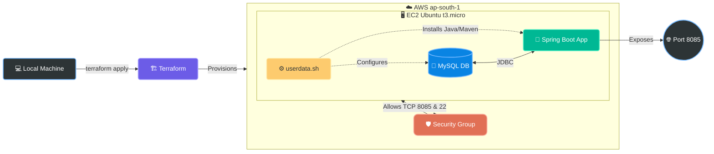

# 🚀 Terraform & Spring Boot AWS Deployment


An end-to-end automated Infrastructure as Code (IaC) project that provisions AWS cloud infrastructure using Terraform and deploys a full-stack Spring Boot application with a MySQL database.

---

## 📑 Table of Contents
1. [Project Overview](#-1-project-overview)
2. [Repository Structure](#-2-repository-structure)
3. [Architecture Diagram](#-3-architecture-diagram)
4. [Technologies Used](#-4-technologies-used)
5. [Prerequisites & AWS Setup](#-5-prerequisites--aws-setup)
6. [Terraform & UserData Breakdown](#-6-terraform--userdata-breakdown)
7. [Deployment Steps](#-7-deployment-steps)
8. [Application Verification](#-8-application-verification)
9. [Troubleshooting](#-9-troubleshooting)
10. [Destroy Infrastructure](#-10-destroy-infrastructure)
11. [Author](#-11-author)

---

## 📋 1. Project Overview

This project demonstrates how to completely automate the deployment lifecycle of a Java-based web application. 

The Terraform configuration executes the following pipeline automatically:
* Provisions an AWS EC2 instance (`t3.micro` running Ubuntu 24.04 LTS).
* Configures strict Security Groups for SSH (22) and Web traffic (8085).
* Bootstraps the server via `userdata.sh` to install Java 17, Maven, Git, and MySQL.
* Clones the application source code from GitHub.
* Builds the application dynamically using Maven.
* Runs the Spring Boot application as a background process.

---

## 📂 2. Repository Structure

```text
terraform-springboot-aws-deploy
│
├── diagrams/
│   └── architecture.png
├── screenshots/
│   ├── terraform-apply.png
│   └── spring-app-running.png
│
├── main.tf              # Primary Terraform configuration for EC2 and SG
├── variables.tf         # Variable definitions for reusability
├── terraform.tfvars     # Variable values (e.g., AMI ID, instance type)
├── outputs.tf           # Defines output values (Public IP, App URL)
├── userdata.sh          # Bash script for automated server provisioning
└── README.md            # Project documentation
```

---

## 🏗️ 3. Architecture Diagram



---

## 💻 4. Technologies Used

* **Infrastructure Automation:** Terraform
* **Cloud Provider:** AWS (EC2, VPC, Security Groups)
* **Application Framework:** Java 17, Spring Boot, Maven
* **Database:** MySQL
* **OS & Scripting:** Ubuntu 24.04 LTS, Bash

---

## ⚙️ 5. Prerequisites & AWS Setup

Ensure you have the following installed and configured:
* [Terraform](https://developer.hashicorp.com/terraform/downloads) CLI
* [AWS CLI](https://docs.aws.amazon.com/cli/latest/userguide/getting-started-install.html) 
* Git & an SSH Client

### AWS IAM & CLI Configuration
1. Create an IAM user with **Programmatic Access** and attach the `AmazonEC2FullAccess` policy.
2. Authenticate your local machine:
```bash
aws configure
# AWS Access Key ID: [Your Access Key]
# AWS Secret Access Key: [Your Secret Key]
# Default region name: ap-south-1
# Default output format: json
```
*Verify configuration:* `aws sts get-caller-identity`

---

## 🔍 6. Terraform & UserData Breakdown

### Terraform (`main.tf`)
The Terraform configuration defines the exact state of our cloud environment. It uses the `aws_instance` resource to spin up the server, attaching a 20GB `gp3` root volume. It also defines an `aws_security_group` to explicitly allow inbound traffic on port `22` (for SSH administration) and `8085` (for application end-users).

### Server Bootstrapping (`userdata.sh`)
Instead of manually configuring the server after it boots, Terraform injects this bash script into the EC2 instance metadata. The script runs automatically as the `root` user during the first boot cycle. It seamlessly handles system updates, dependency installations (Java, Maven, MySQL), database initialization, code cloning from GitHub, and triggering the Maven build process.

---

## 🚀 7. Deployment Steps

**1. Initialize Terraform**
```bash
terraform init
```

**2. Validate Configuration**
```bash
terraform validate
```

**3. Preview Infrastructure Changes**
```bash
terraform plan
```

**4. Deploy Infrastructure**
```bash
terraform apply -auto-approve
```

---

## 🌐 8. Application Verification

Once deployed, Terraform will output the server's public IP and URL via `outputs.tf`.

**Access the Web App:**
```text
http://<EC2_PUBLIC_IP>:8085
```

**SSH into the EC2 Instance:**
```bash
ssh -i keypairfor_allTraffic1.pem ubuntu@<EC2_PUBLIC_IP>
```

**Verify Running Processes on the Server:**
* Check Spring Boot status: `ps -ef | grep java`
* View application logs: `cat /home/ubuntu/spring_mysql_kubeadm_sakcoorg/app.log`
* Verify port 8085: `sudo ss -tulnp | grep 8085`

---

## 🛠️ 9. Troubleshooting

| Issue | Cause | Solution |
| :--- | :--- | :--- |
| **SSH Connection Timeout** | EC2 instance lacked a public IP. | Set `associate_public_ip_address = true` in `main.tf`. |
| **SSH Key Permission Error** | Windows enforces strict private key security (`UNPROTECTED PRIVATE KEY FILE`). | Run `icacls` to grant user read access and remove `BUILTIN\Users`. |
| **MySQL Auth Denied** | Spring Boot failed to connect to local MySQL root user. | Updated `userdata.sh` to run: `ALTER USER 'root'@'localhost' IDENTIFIED WITH mysql_native_password BY '1234'; FLUSH PRIVILEGES;` |

---

## 🧹 10. Destroy Infrastructure

**Best Practice:** Always tear down cloud resources when not in use to prevent unexpected AWS charges.
```bash
terraform destroy -auto-approve
```

---

## 👨‍💻 11. Author

**ashu** | DevOps & Cloud Engineer  
🔗 [GitHub Profile](https://github.com/ashu-and-anand) | 🎯 [LeetCode Profile](https://leetcode.com/u/aashu-AND-anand/)