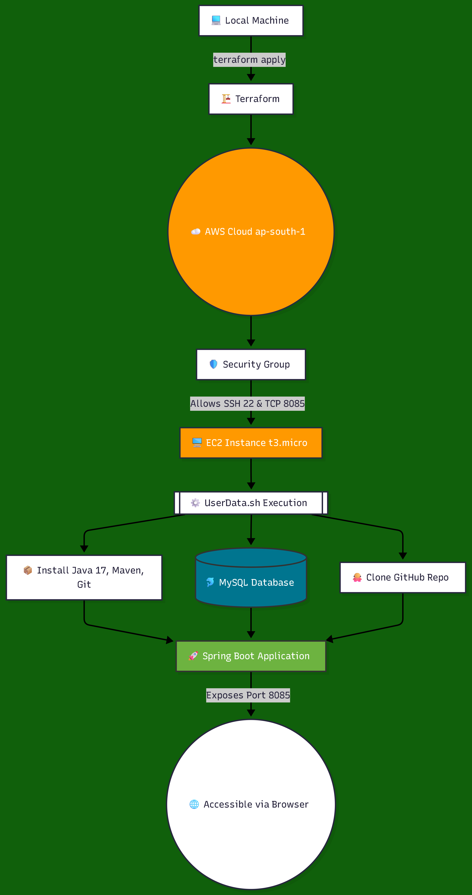
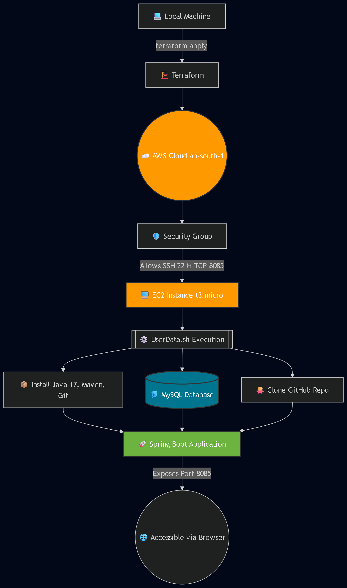
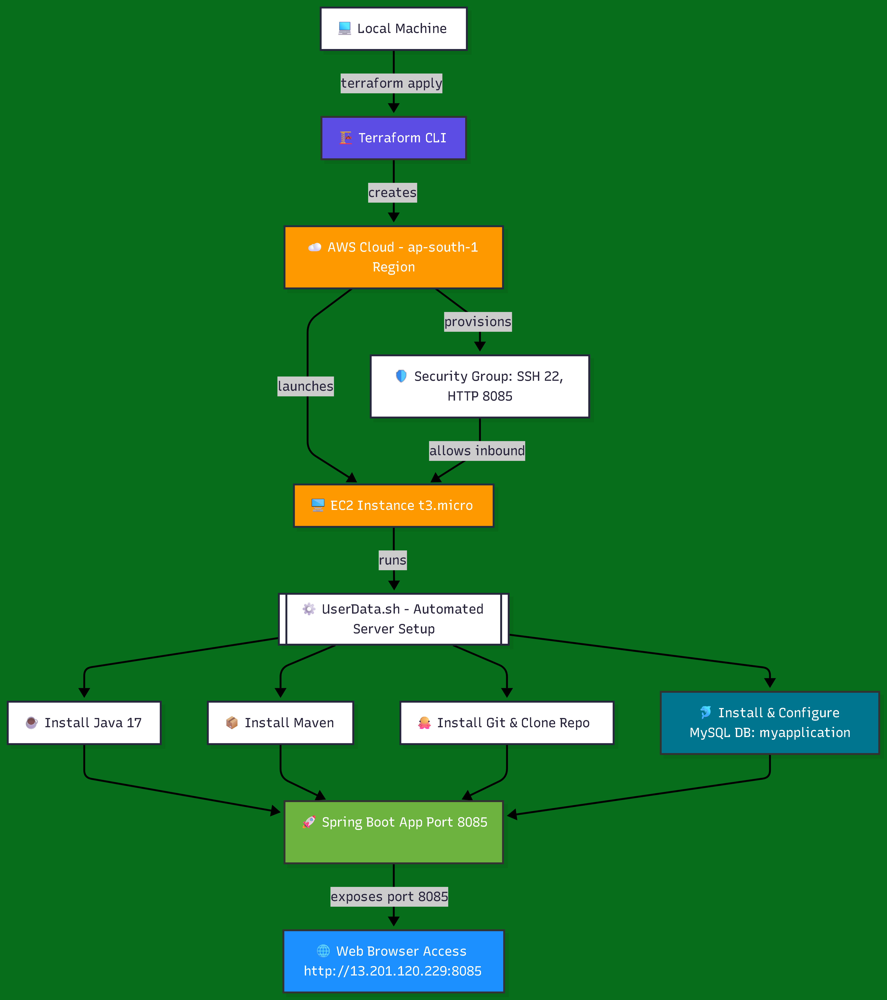
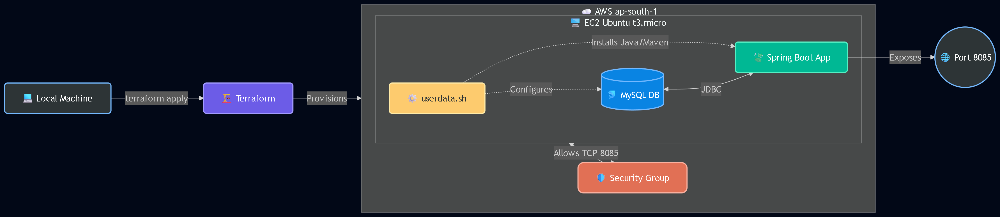
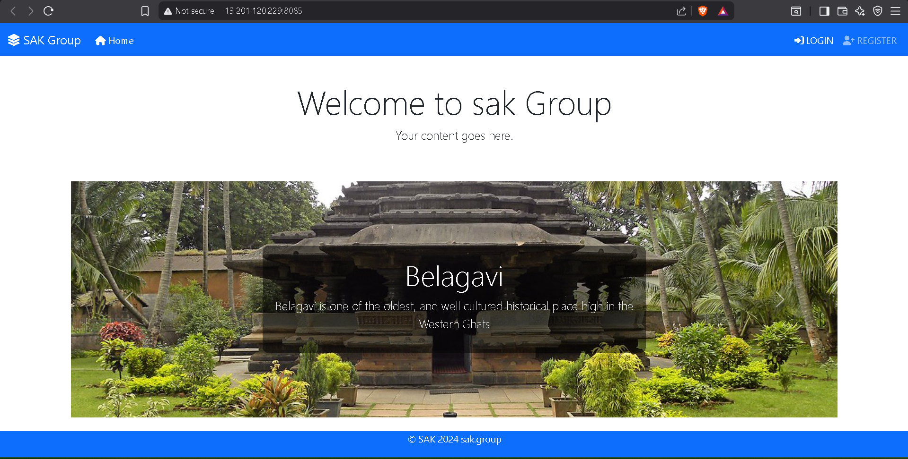
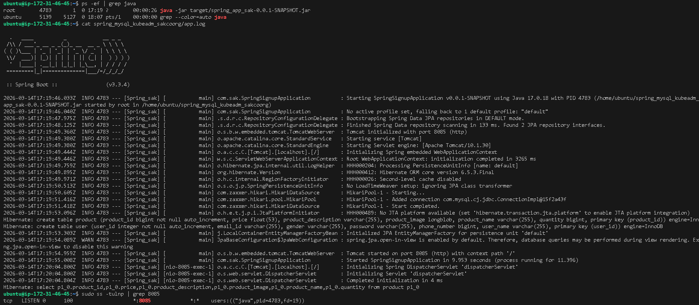
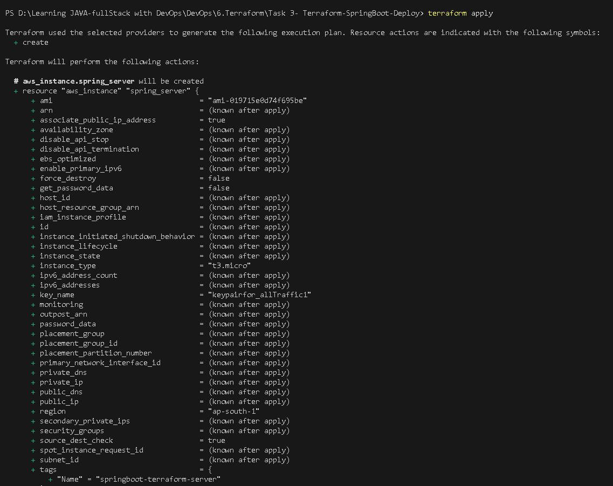
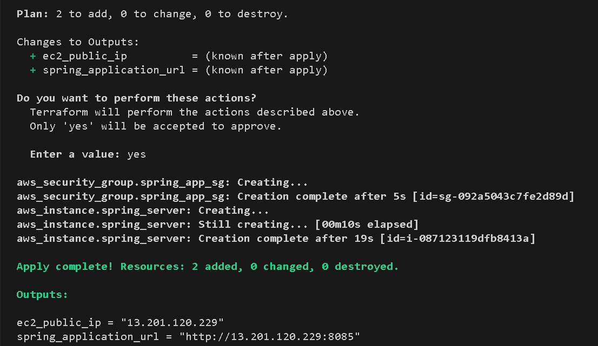

# Terraform Deployment of Spring Boot Application on AWS EC2

## Project Overview

This project demonstrates **Infrastructure as Code (IaC)** using **Terraform** to automatically deploy a **Spring Boot application with MySQL** on an **AWS EC2 instance**.

The Terraform configuration performs the following tasks automatically:

* Creates an AWS EC2 instance
* Configures security groups
* Installs Java, Maven, and MySQL
* Clones a Spring Boot project from GitHub
* Builds the project using Maven
* Runs the application automatically
* Exposes the application on **port 8085**

The goal of this project is to demonstrate **automated application deployment using Terraform and AWS infrastructure**.

---

# Architecture Diagram

```
Local Machine
     │
     │ Terraform Apply
     ▼
AWS Infrastructure
     │
     ▼
EC2 Instance (Ubuntu)
     │
     ▼
UserData Script Executes
     │
     ├── Install Java
     ├── Install Maven
     ├── Install MySQL
     ├── Clone Spring Boot Repo
     ├── Build Application
     └── Run Application
     │
     ▼
Spring Boot Application Running
     │
     ▼
Accessible via Browser
http://EC2_PUBLIC_IP:8085
```

---

# Technologies Used

* Terraform
* AWS EC2
* Spring Boot
* Maven
* MySQL
* Ubuntu Server
* AWS CLI
* SSH

---

# Prerequisites

Before running this project ensure you have:

* AWS Account
* Terraform installed
* AWS CLI installed
* SSH client installed
* Git installed
* AWS IAM user with programmatic access

---

# AWS IAM Setup

Create an IAM user with **programmatic access**.

Attach permissions:

```
AmazonEC2FullAccess
```

Generate:

```
Access Key
Secret Key
```

---

# Configure AWS CLI

Run:

```
aws configure
```

Provide:

```
AWS Access Key
AWS Secret Key
Region = ap-south-1
Output format = json
```

Verify configuration:

```
aws sts get-caller-identity
```

---

# Terraform Configuration

## Provider Configuration

```
provider "aws" {
  region = "ap-south-1"
}
```

---

# EC2 Instance Configuration

```
resource "aws_instance" "spring_server" {

  ami           = var.ami_id
  instance_type = var.instance_type
  key_name      = var.key_pair_name

  associate_public_ip_address = true

  vpc_security_group_ids = [aws_security_group.spring_app_sg.id]

  user_data = file("userdata.sh")

  root_block_device {
    volume_size = 20
    volume_type = "gp3"
  }

  tags = {
    Name = "spring-boot-server"
  }

}
```

---

# Security Group Configuration

```
resource "aws_security_group" "spring_app_sg" {

  name = "spring-app-security-group"

  ingress {
    from_port   = 22
    to_port     = 22
    protocol    = "tcp"
    cidr_blocks = ["0.0.0.0/0"]
  }

  ingress {
    from_port   = 8085
    to_port     = 8085
    protocol    = "tcp"
    cidr_blocks = ["0.0.0.0/0"]
  }

  egress {
    from_port   = 0
    to_port     = 0
    protocol    = "-1"
    cidr_blocks = ["0.0.0.0/0"]
  }

}
```

---

# UserData Script

The EC2 instance executes a startup script automatically.

```
#!/bin/bash

sudo apt update -y

sudo apt install openjdk-17-jdk -y

sudo apt install maven -y

sudo apt install mysql-server -y

sudo systemctl start mysql

sudo systemctl enable mysql

sudo mysql -e "CREATE DATABASE IF NOT EXISTS myapplication;"

cd /home/ubuntu

git clone https://github.com/sakit333/spring_mysql_kubeadm_sakcoorg.git

cd spring_mysql_kubeadm_sakcoorg

sed -i 's/mysql-service/localhost/g' src/main/resources/application.properties

mvn clean package

nohup java -jar target/*.jar > app.log 2>&1 &
```

---

# Deployment Steps

Initialize Terraform:

```
terraform init
```

Validate configuration:

```
terraform validate
```

Check infrastructure plan:

```
terraform plan
```

Deploy infrastructure:

```
terraform apply
```

---

# Application Access

After deployment Terraform will output:

```
spring_application_url
```

Open in browser:

```
http://EC2_PUBLIC_IP:8085
```

---

# SSH Access to EC2

```
ssh -i keypairfor_allTraffic1.pem ubuntu@EC2_PUBLIC_IP
```

---

# Application Verification

Check if Spring Boot is running:

```
ps -ef | grep java
```

Check logs:

```
cat spring_mysql_kubeadm_sakcoorg/app.log
```

Check port status:

```
sudo ss -tulnp | grep 8085
```

---

# Problems Encountered and Solutions

## SSH Connection Timeout

Cause:

```
EC2 instance created without public IP
```

Solution:

```
associate_public_ip_address = true
```

---

## SSH Private Key Permission Error (Windows)

Error:

```
WARNING: UNPROTECTED PRIVATE KEY FILE
```

Solution:

```
icacls keypairfor_allTraffic1.pem /inheritance:r
icacls keypairfor_allTraffic1.pem /grant:r "$($env:USERNAME):(R)"
icacls keypairfor_allTraffic1.pem /remove "BUILTIN\Users"
```

---

## MySQL Authentication Error

Error:

```
Access denied for user 'root'@'localhost'
```

Solution:

```
ALTER USER 'root'@'localhost'
IDENTIFIED WITH mysql_native_password BY '1234';
FLUSH PRIVILEGES;
```

---

# Destroy Infrastructure

To remove all created resources:

```
terraform destroy
```

---

# Best Practices

* Never store AWS credentials inside Terraform files
* Use AWS CLI credential configuration
* Always destroy unused infrastructure
* Restrict security groups in production
* Use Terraform state management

---

=====================================================================

Developer Machine
 (Terraform CLI)
        │
        │ terraform apply
        ▼
+-----------------------------+
|        AWS Cloud            |
|                             |
|  +-----------------------+  |
|  |   EC2 Instance        |  |
|  |   Ubuntu Server       |  |
|  |                       |  |
|  |  UserData Script      |  |
|  |  ------------------   |  |
|  |  Install Java        |  |
|  |  Install Maven       |  |
|  |  Install MySQL       |  |
|  |  Clone GitHub Repo   |  |
|  |  Build Spring App    |  |
|  |  Run Spring Boot     |  |
|  +-----------------------+  |
|            │                |
|            ▼                |
|      Spring Boot App       |
|         Port 8085          |
|            │                |
+------------│----------------+
             │
             ▼
      Web Browser
http://EC2_PUBLIC_IP:8085

=====================================================================

## Architecture Diagram






=====================================================================

## Results






=====================================================================
# Author

**ashu** | DevOps & Cloud Engineer  

Terraform + AWS + Spring Boot Deployment

🔗 [GitHub Profile](https://github.com/ashu-and-anand) | 🎯 [LeetCode Profile](https://leetcode.com/u/aashu-AND-anand/)


## THE-END